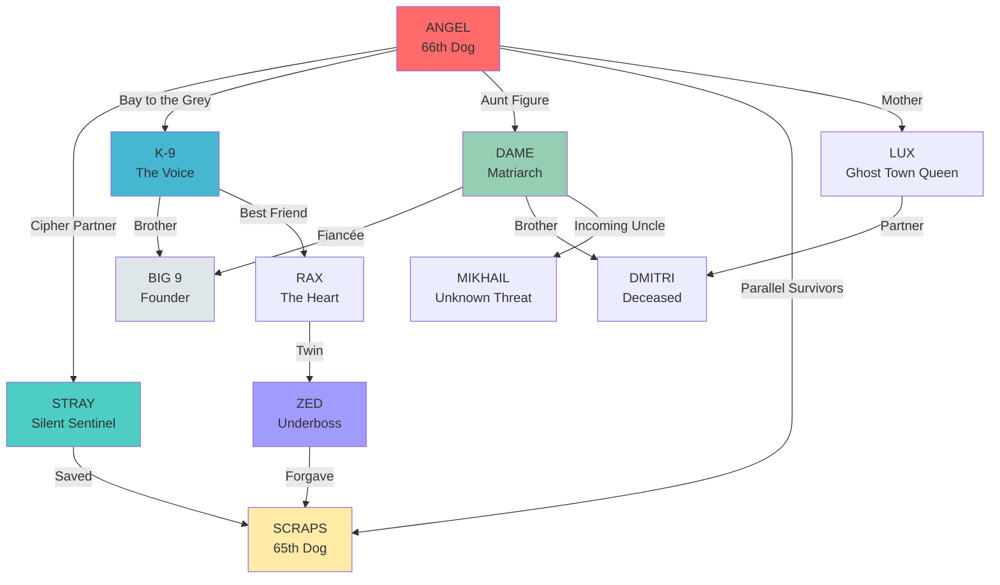

# CHARACTER NETWORK GRAPH

---

## NODE DESCRIPTIONS

### Red (Angel) — The Connector
Most connections in network. Bridges Oakland-London, connects all storylines.

### Teal (Stray) — The Anchor
Fewer connections, but each one is profound. Only person whose tinnitus quiets around Angel.

### Blue (K-9) — The Voice
Public face, most external relationships. Brother to Big 9, best friend to Rax.

### Green (Dame) — The Hub
Operational center. Connects Big 9 (past), Angel (present), Mikhail (future).

### Yellow (Scraps) — The Redeemed
Newest addition, connects to both Stray (salvation) and Zed (forgiveness).

### Grey (Big 9) — The Ghost
Incarcerated but still commands through Dame, K-9, letters.

### Purple (Zed) — The Underboss
Twin to Rax, forgave Scraps, first public verse (Track 06).
