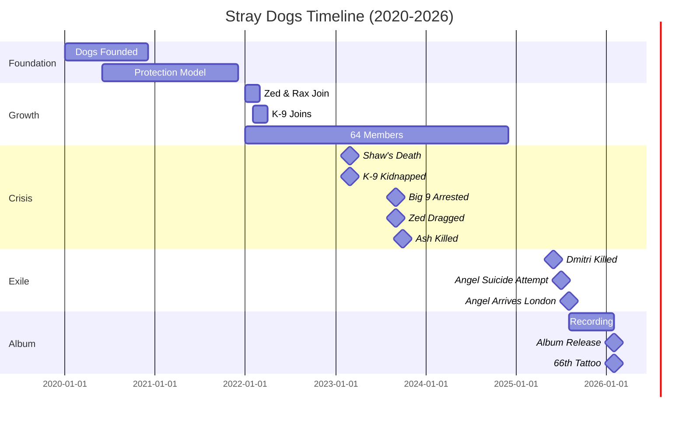

# TIMELINE VISUALIZATION



---

## COLOR-CODED EVENT TYPES

🔴 **RED** — Deaths, violence (Shaw, Dmitri, Ash, Zed's drag)
🟡 **YELLOW** — Arrests, legal (Big 9, RICO investigation)
🟢 **GREEN** — Additions, growth (new Dogs, Angel arrives, album release)
🔵 **BLUE** — Relationships, bonds (forgiveness, cipher partnerships)
⚪ **WHITE** — Infrastructure (Kennel opens, protection zones)

---

## PARALLEL TIMELINES

### OAKLAND (Angel's Timeline)
```
2020: Lil Trey killed → Angel begins ProphetFilms
2023-2025: Active Ghost Town, Dmitri alive
2025 June: Dmitri killed (70 shots)
2025 July: 72 pills suicide attempt
2025 August: Extracted to London
```

### LONDON (Dogs' Timeline)
```
2020: Stray Dogs founded
2023 March: Shaw killed, K-9 kidnapped, Big 9's rampage
2023 Late: Big 9 arrested, Zed dragged, Stray stops speaking
2025 August: Angel arrives
2026 February: Album drops, 66 Dogs complete
```

### CONVERGENCE POINT
**August 2025** — Angel's arrival creates Oakland-London bridge
